# 🏗️ Architecture Documentation

## 📋 Table of Contents

1. [System Overview](#system-overview)
2. [Core Architecture Patterns](#core-architecture-patterns)
3. [Service Layer Design](#service-layer-design)
4. [Data Flow & Service Communication](#data-flow--service-communication)
5. [Dependency Injection System](#dependency-injection-system)
6. [Configuration Management](#configuration-management)
7. [Error Handling Strategy](#error-handling-strategy)
8. [Performance Optimizations](#performance-optimizations)

---

## 🎯 System Overview

The **js-podcast-gen** application follows a clean, modular architecture based on SOLID principles, implementing a layered service-oriented design with dependency injection. The system transforms text content into high-quality podcasts through a coordinated pipeline of AI services.

### 🎪 High-Level Architecture

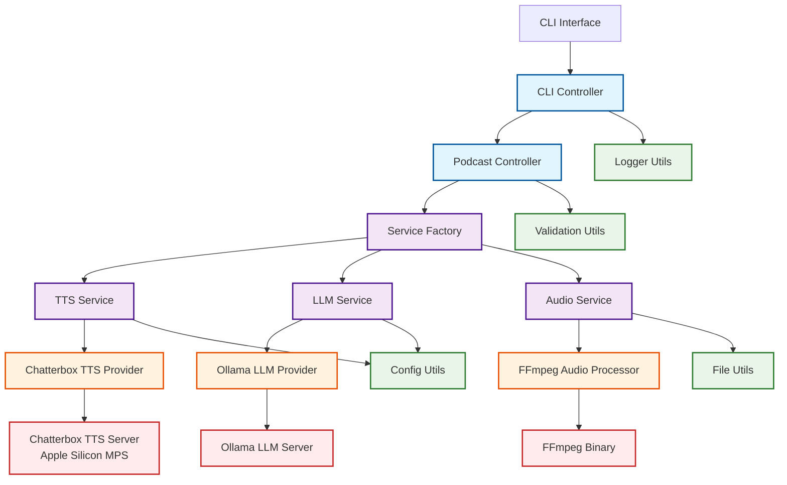

---

## 🛠 Core Architecture Patterns

### 1. **Layered Architecture**

The application is organized into distinct layers, each with specific responsibilities:

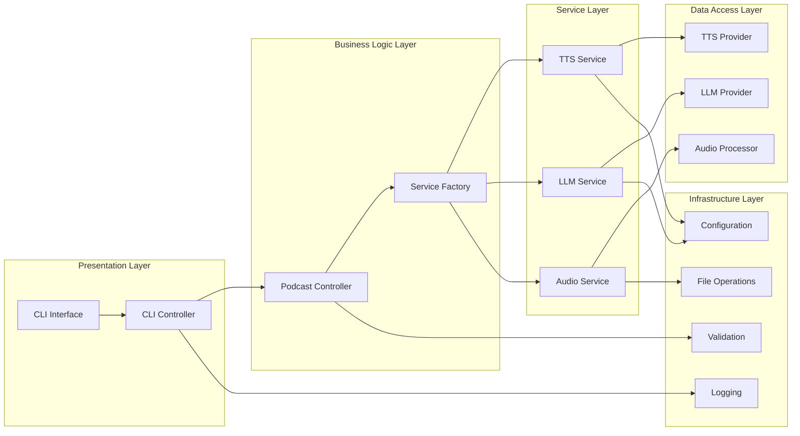

### 2. **SOLID Principles Implementation**

#### **Single Responsibility Principle (SRP)**
- **TTSService**: Handles only text-to-speech operations and segmentation
- **LLMService**: Manages only language model interactions and script generation
- **AudioService**: Responsible only for audio processing and file operations
- **ConfigUtils**: Manages only configuration and settings

#### **Open/Closed Principle (OCP)**
- Services are open for extension via interfaces
- New TTS providers can be added without modifying existing code
- Audio processors can be swapped through the `IAudioProcessor` interface

#### **Liskov Substitution Principle (LSP)**
- All providers implement their respective interfaces completely
- `ChatterboxProvider` can be substituted with any `ITTSProvider`
- `FFmpegConcatenator` can be replaced with any `IAudioProcessor`

#### **Interface Segregation Principle (ISP)**
- Small, focused interfaces: `ITTSProvider`, `IAudioProcessor`, `ILLMProvider`
- Clients depend only on methods they actually use

#### **Dependency Inversion Principle (DIP)**
- High-level modules depend on abstractions (interfaces)
- Dependencies are injected rather than created directly
- ServiceFactory manages all dependency creation

---

## 🎛 Service Layer Design

### Service Factory Pattern

The `ServiceFactory` implements a factory pattern to create services with dynamic configuration:

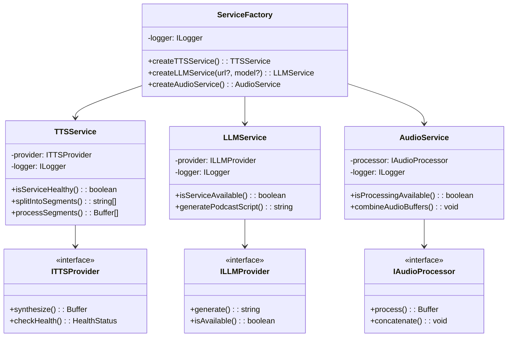

---

## 🔄 Data Flow & Service Communication

### Complete Podcast Generation Flow

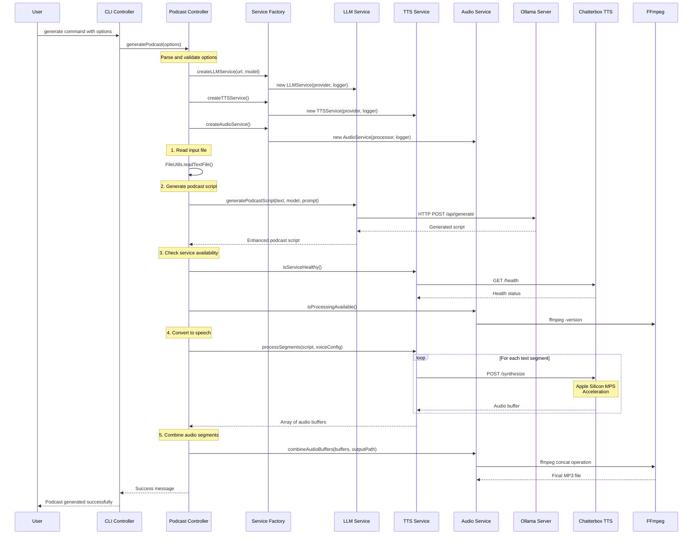

### Service Health Check Flow

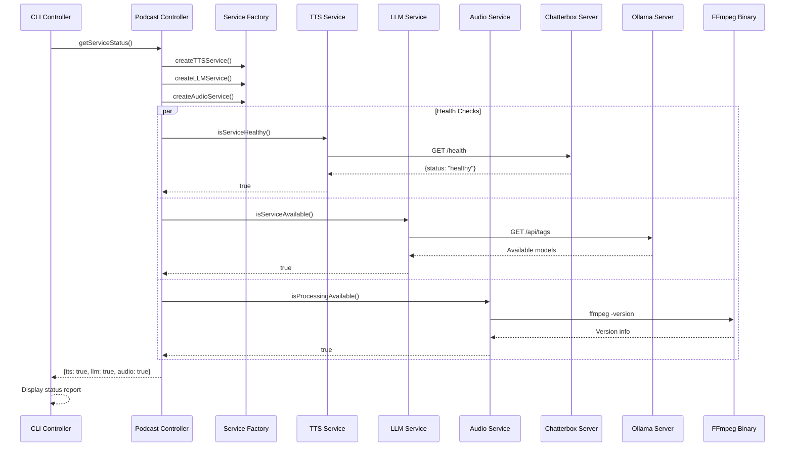

---

## 🔌 Dependency Injection System

### Service Creation and Injection

The application uses a centralized dependency injection pattern through the `ServiceFactory`:

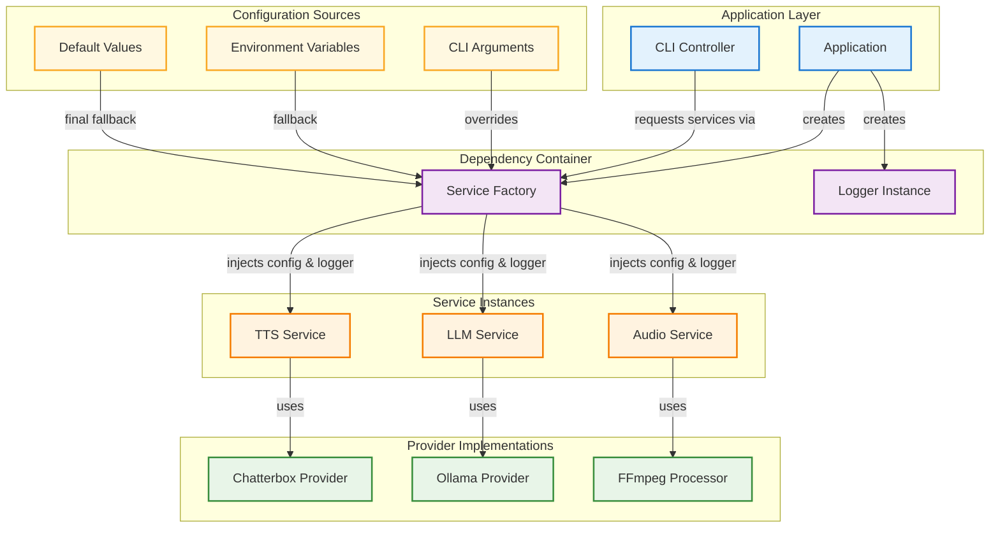

### Configuration Hierarchy

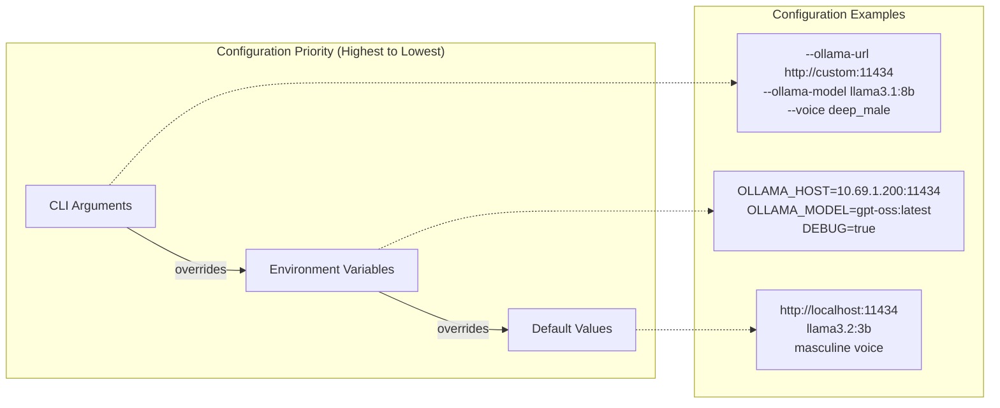

---

## ⚙️ Configuration Management

### Dynamic Configuration System

The configuration system supports runtime customization with intelligent fallbacks:

```typescript
// Configuration Resolution Example
class ConfigUtils {
  static getOllamaConfig(customUrl?: string, customModel?: string) {
    return {
      host: customUrl || process.env.OLLAMA_HOST || 'http://localhost:11434',
      model: customModel || process.env.OLLAMA_MODEL || 'llama3.2:3b'
    };
  }
  
  static buildPodcastPrompt(inputText: string, customPrompt?: string): string {
    const prompt = customPrompt || this.getDefaultPodcastPrompt();
    return prompt.replace('{INPUT_TEXT}', inputText);
  }
}
```

### Voice Configuration Matrix

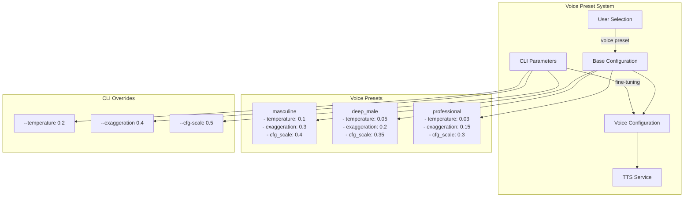

---

## 🛡️ Error Handling Strategy

### Comprehensive Error Management

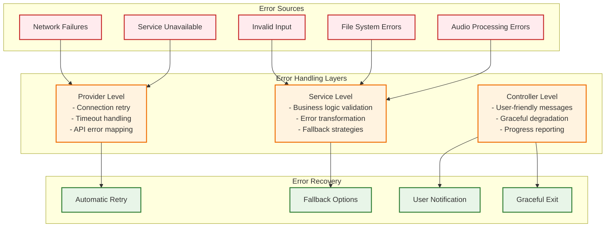

### Error Flow Example

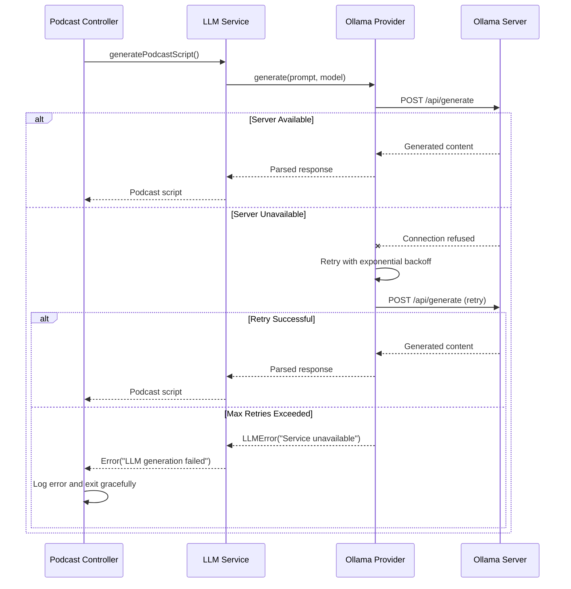

---

## ⚡ Performance Optimizations

### Apple Silicon MPS Acceleration

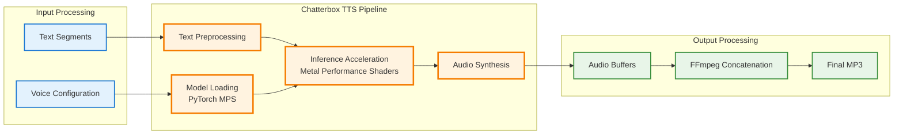

### Concurrent Processing Architecture

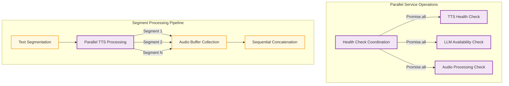

---

## 🔧 Service Interface Contracts

### TTS Provider Interface

```typescript
interface ITTSProvider {
  synthesize(text: string, config?: VoiceConfig): Promise<Buffer>;
  checkHealth(): Promise<HealthStatus>;
  getVoicePresets(): Promise<string[]>;
}

// Implementation ensures consistent behavior
class ChatterboxProvider implements ITTSProvider {
  async synthesize(text: string, config?: VoiceConfig): Promise<Buffer> {
    // Apple Silicon optimized synthesis
  }
  
  async checkHealth(): Promise<HealthStatus> {
    // Health endpoint validation
  }
}
```

### Audio Processor Interface

```typescript
interface IAudioProcessor {
  process(segments: Buffer[]): Promise<Buffer>;
  concatenate(paths: string[], output: string): Promise<void>;
  supports(format: string): boolean;
  isAvailable(): Promise<boolean>;
}

// FFmpeg implementation
class FFmpegConcatenator implements IAudioProcessor {
  async concatenate(paths: string[], output: string): Promise<void> {
    // High-quality MP3 concatenation with fade effects
  }
}
```

---

## 🚀 Scalability Considerations

### Horizontal Scaling Potential

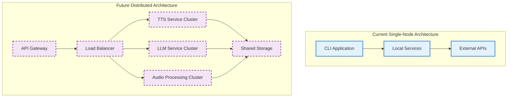

### Performance Metrics

- **TTS Processing**: ~2-3 seconds per 100-character segment with MPS acceleration
- **LLM Generation**: ~5-10 seconds for script generation (varies by model size)
- **Audio Concatenation**: ~1-2 seconds for 10-minute podcast
- **Memory Usage**: ~500MB peak during processing (model loading)
- **Apple Silicon Optimization**: 3-4x faster than CPU-only processing

---

## 📊 Monitoring and Observability

### Service Health Monitoring

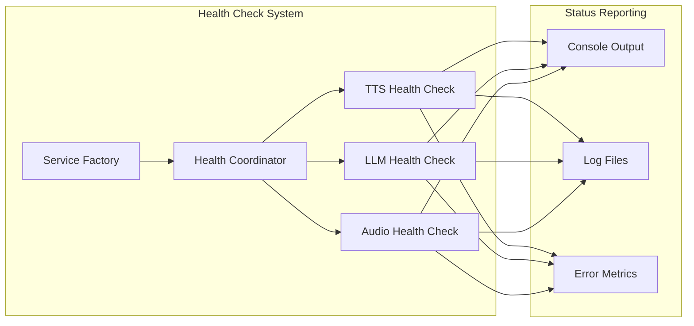

This architecture provides a robust, scalable, and maintainable foundation for high-quality podcast generation while maintaining clean separation of concerns and extensibility for future enhancements.
